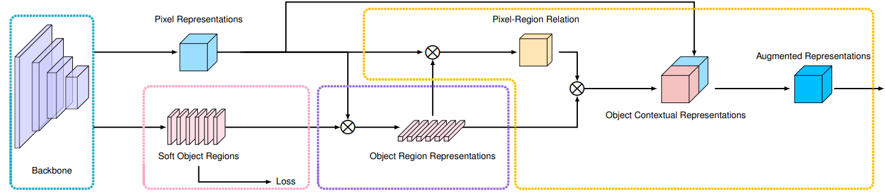

### Introduction

本项目主要复现语义分割中的sota模型：HRNet+OCR

HRNet：[high-resolution representations for Semantic Segmentation](https://arxiv.org/abs/1904.04514)

<!--  -->

<figure>
  <text-align: center;>
  
</figcaption>
</figure>

OCR： [Object Contextual Representation](https://arxiv.org/pdf/1909.11065.pdf) 

<figure>
  <text-align: center;>
  
</figure>
接下来以导地线分割数据集（daodixian_seg）为例，讲解一下代码的使用

### Data preparation
Cityscapes数据集官方地址：https://www.cityscapes-dataset.com/

Cityscapes数据集OSS地址：s3://jiashuaishuai/cityscapes/

daodixian_seg数据集OSS地址：s3://jiashuaishuai/to_chencheng/daodixian_seg/

Your directory tree should be look like this:
````bash
$SEG_ROOT/data
├── cityscapes
│   ├── gtFine
│   │   ├── test
│   │   ├── train
│   │   └── val
│   └── leftImg8bit
│       ├── test
│       ├── train
│       └── val
├── daodixian_seg
│   ├── train_1209
│   │   ├── images
│   │   └── annotations
│   └── val_1209
│       ├── images
│       └── annotations
├── list
│   ├── cityscapes
│   │   ├── test.lst
│   │   ├── trainval.lst
│   │   └── val.lst
│   ├── daodixian_seg
│   │   ├── test_1209.lst
│   │   ├── train_1209.lst
│   │   └── val_1209.lst
````

注：daodixian_seg数据集这么准备的原因可以去 <u>lib/datasets/daodixian_seg.py</u> 脚本中查看

### Config

训练及测试中所需的所有参数都在 experiments/daodixian_seg/seg_hrnet_ocr_w48_epoch48_1209.yaml 文件中指定

### Train and Test

**训练指令：**

> rlaunch --cpu=16 --gpu=4 --memory=$((120*1024)) --max-wait-time 10h --preemptible=no --charged-group v_tracking -- python3 -m torch.distributed.launch --nproc_per_node=4 tools/train_daodixian_seg.py --cfg experiments/daodixian_seg/seg_hrnet_ocr_w48_epoch48_1209.yaml

**测试指令：**

> rlaunch --cpu=16 --gpu=1 --memory=$((120*1024)) --max-wait-time 10h --preemptible=no --charged-group v_tracking -- python3 tools/test.py --cfg experiments/daodixian_seg/seg_hrnet_ocr_w48_epoch48_1209.yaml

### Tools

tools_jss/json2lableImg_jss.py：该脚本将json标注的多边形转为cityscapes数据集所需的png标注格式

### Reference

参考 [HRNet-Semantic-Segmentation](https://github.com/HRNet/HRNet-Semantic-Segmentation/tree/HRNet-OCR)，阅读r本文档之前建议先阅读一下原作者的readme_ori.md文档

### Contact

ssjia_cv@foxmail.com

### Citation

If you find this work or code is helpful in your research, please cite:
````
@inproceedings{SunXLW19,
  title={Deep High-Resolution Representation Learning for Human Pose Estimation},
  author={Ke Sun and Bin Xiao and Dong Liu and Jingdong Wang},
  booktitle={CVPR},
  year={2019}
}

@article{WangSCJDZLMTWLX19,
  title={Deep High-Resolution Representation Learning for Visual Recognition},
  author={Jingdong Wang and Ke Sun and Tianheng Cheng and 
          Borui Jiang and Chaorui Deng and Yang Zhao and Dong Liu and Yadong Mu and 
          Mingkui Tan and Xinggang Wang and Wenyu Liu and Bin Xiao},
  journal={TPAMI},
  year={2019}
}

@article{YuanCW19,
  title={Object-Contextual Representations for Semantic Segmentation},
  author={Yuhui Yuan and Xilin Chen and Jingdong Wang},
  booktitle={ECCV},
  year={2020}
}

````


